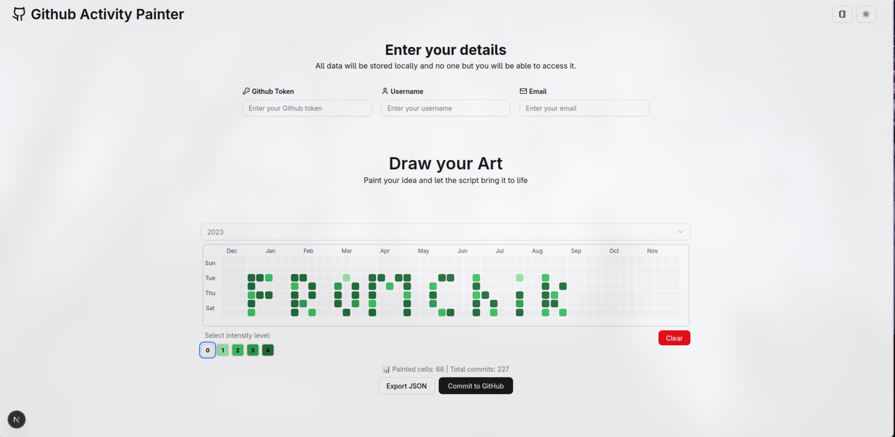
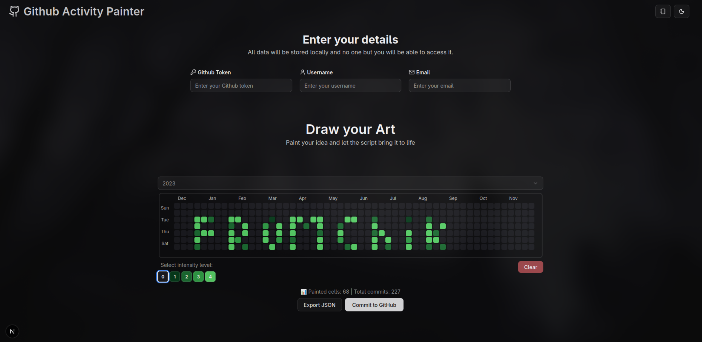

# 🎨 GitHub Activity Painter

<div align="center">

### Turn your GitHub contribution graph into pixel art!

**Run locally • Draw visually • Commit in one click**

</div>

---

## 👋 Hello!

Welcome to **GitHub Activity Painter**. This is a simple, creative tool that lets you draw on your GitHub contribution calendar.

Want to write a message, draw a heart, or create a cool pattern on your profile? You don't need to manually push empty commits for days. Just draw what you want on the grid, and this app handles the rest!

### 🌟 Why use this?
- **Creativity:** Make your profile stand out.
- **Privacy First:** The app runs **locally** on your computer. Your data stays with you.
- **One-Click Magic:** No complex Git commands. Just click "Commit" and watch your graph update.
- **Undo/Redo:** Messed up? Just clear the grid or erase pixels before committing.

---

## 💻 How to Run (Local Only)

Since this app is designed to run securely on your own machine, follow these simple steps to get started.

### Prerequisites
Make sure you have [Node.js](https://nodejs.org/) installed on your computer.

### Installation

1. **Clone the repository** (or download the ZIP):
```bash
git clone [https://github.com/fromchik/github-activity-painter.git](https://github.com/fromchik/github-activity-painter.git)
cd github-activity-painter


2. **Install dependencies:**
```bash
npm install

```


3. **Start the app:**
```bash
npm run dev

```


4. **Open your browser:**
Go to [http://localhost:3000](https://www.google.com/search?q=http://localhost:3000)

---

## 🎨 How to Use

### 1. Get your GitHub Token

To let the app draw on your profile, you need a key (Token).

1. Go to [GitHub Settings → Developer settings → Personal access tokens (classic)](https://github.com/settings/tokens/new).
2. Generate a new token.
3. **Important:** Select the `repo` checkbox (this gives permission to create commits).
4. Copy the token immediately!

### 2. Enter Your Details

In the app, fill in the fields at the top:

* **Token:** Paste the key you just copied.
* **Username:** Your GitHub username.
* **Email:** The email you use for GitHub.

> 🔒 **Privacy Note:** These details are saved in your browser's Local Storage so you don't have to re-enter them. They are never sent to any third-party server.

### 3. Start Painting!

* **Left Click:** Paint a square.
* **Drag:** Paint continuously.
* **Select Intensity:** Choose different shades of green (0-4) using the buttons below the grid.
* **Clear:** Wipe the canvas to start over.

### 4. Commit to GitHub

Once you love your drawing:

1. Click **"Commit to GitHub"**.
2. Wait a few seconds for the progress bar.
3. Done! Go check your GitHub profile page to see your new art.

---

## 📸 Screenshots

<div align="center">
    
    
</div>

---

## ⚠️ A Friendly Reminder

* **Be Patient:** It might take a few minutes for GitHub to update the visual graph on your profile after uploading.
* **Responsible Use:** This tool creates real commits in your repository. Please use it for fun and creativity, and don't spam the platform.

---

<div align="center">

**Made with 💚 by [fromchik**](https://www.google.com/search?q=https://github.com/fromchik)

</div>

